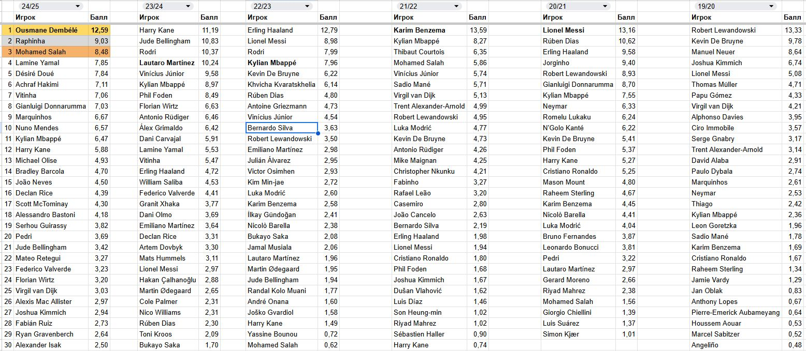
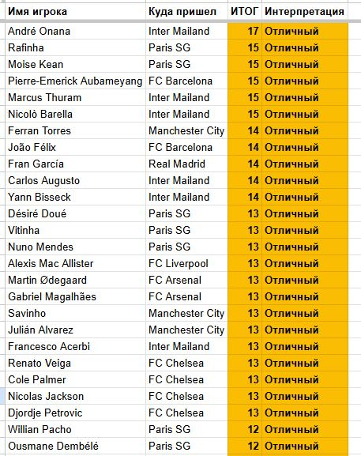
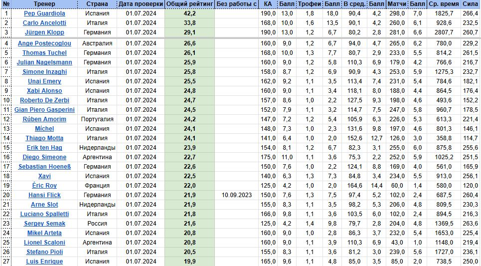

# 📊 Football Analytics Portfolio in Google Sheets

A collection of automated spreadsheets for football statistics analysis.

## 🎯 Projects

### [⚽ Golden Ball](links/project1-links.md)
Automated system for calculating the fair winner of the "Ballon d'Or" based on three components: individual statistics, team trophies, and personal awards.
- **Complexity:** ★★★★☆
- **Technologies:** array formulas, filtering, data normalization, correlation
- **Result:** ranking of Ballon d'Or contenders over the last 7 seasons

### [📈 Transfer Analysis](links/project2-links.md)
Evaluation of football player transfers based on price, performance metrics, salary, and additional indicators.
- **Complexity:** ★★★☆☆
- **Technologies:** array formulas, filtering, data normalization, pivot tables
- **Result:** ranking of the most successful and unsuccessful transfers over the last 6 seasons

### [🏆 Coach Rating](links/project3-links.md)
Assessment of football coaches' effectiveness based on deviation of actual results from expected outcomes and number of trophies (7,000+ matches analyzed).
- **Complexity:** ★★★★★
- **Technologies:** Apps Script, array formulas, filtering
- **Result:** ranking of the best and worst coaches over the last 5 seasons

## 🖼️ Gallery

| Project 1 | Project 2 | Project 3 |
|-----------|-----------|-----------|
|  |  |  |

## 🚀 How to Use
1. Go to the `links/` folder
2. Open the file for your desired project
3. Follow the link to Google Sheets
4. Make a copy to experiment with

## 📞 Contact
For questions or collaboration: reaktiv96@gmail.com